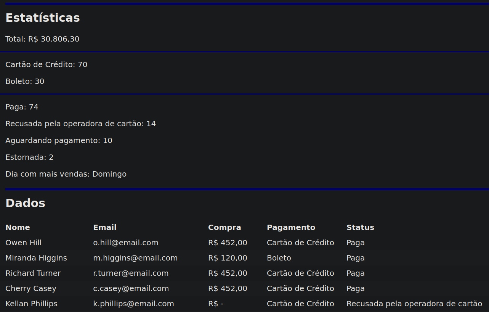

# Statistic API Typescript




> Estudo de Typescript focado na manipulação da API Origamid.

## 💻 Pré-requisitos

Antes de começar, verifique se você atendeu aos seguintes requisitos:
* Você instalou a versão mais recente de `<javascript / typescript>`
* Você tem uma máquina `<Windows / Linux / Mac>`.

## ☕ Usando <Statistic API>

Para usar <Statistic API>, siga estas etapas:

```
tsc
```

## 📝 Licença

Esse projeto está sob licença. Veja o arquivo [LICENÇA](LICENSE.md) para mais detalhes.
